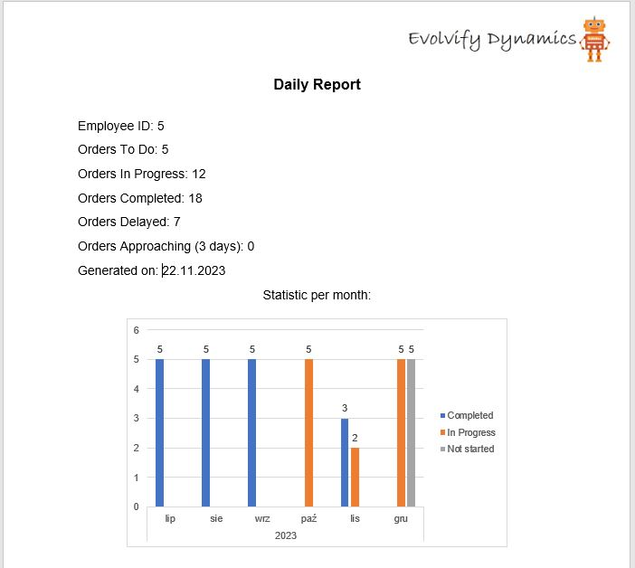
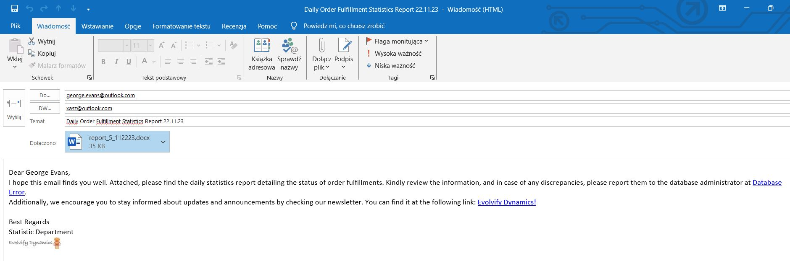

# Daily Report Generator

Daily Report Generator is a project prepared in Visual Basic for Application language in integration with Word and Outlook.

The main goal of the project is to automate 
repetitive activites. The input is simply database with orders, orders details and employee ID's created in Excel sheet. 
Running the code refreshes a sheet with Employee statistics and a visualization showing productivity.

Before running the macro, check the available references. You need to have Microsoft Outlook Object Library and Microsoft Word Library. Change the paths from the macro according to the comments.

## How it works?

Step one is to run macro. Open ReportGeneration.xlsm file and run the macro named 'SendReminder'. 

At the beginning sheet called 'Statistics' is updated. Sheet is based on the database found in the 'Order' sheet.

Then the old word report filers are moved to the archive folder.

Then the script opens the report template in Word. It puts the date form 'Statistics' in special plases in Word. For this purpose are used bookmarks. 
The visualization from the sheet 'Chart' is updated and also placed in Word.

Personalized report for the employee is saved to disk.

 

The last step is to prepared emails to employees. The data is taked from the sheet 'Employees'. The message comes with a Word file and a fixed message template encoded with html. The email contains a link to the website and a link to email of the IT specialist.

